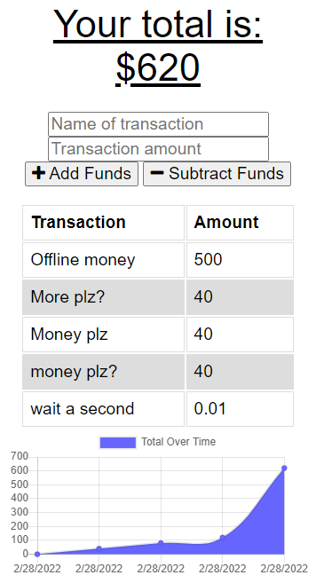

# Budget Boss

Thanks for visiting Budget Boss. This repo is built on starter code for U of MN Full Stack Flex Bootcamp challenge 19.

## Features

- Submit transactions to add or subtract from your funds
- See a graph of funds over time
- PWA: it's an installable Progressive Web Application thanks to manifest.json
- IndexedDB and Service Workers allow offline saving of submitted transactions, so you never lose one, even if the internet is spotty where you are. The app will work as if you have connection, as long as you've connected to it once.

## How To Use

The app is deployed on Heroku:
[https://budget-bozz.herokuapp.com/](https://budget-bozz.herokuapp.com/)

- Add a name of transaction and transaction amount
- Click "Add Funds" or "Subtract Funds" 
- And you're off! Big savings coming your way soon.

## Authors

[mwegter95](https://github.com/mwegter95)

U of MN Bootcamp starter code

## Screenshots

